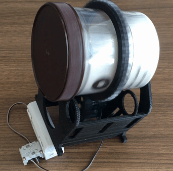

# sandpolisher
A gelato can, a can of sand. a supporting structure. a motor, two gears. a power supply, a switch,could make a good polisher for 3d printed parts

### ref links:
- 1. [inspiration](https://www.thingiverse.com/thing:3666116)
- 2. [about gears](http://fab.cba.mit.edu/classes/863.09/people/cranor/How_to_Make_%28Almost%29_Anything/David_Cranor/Entries/2009/10/12_Entry_1_files/module.pdf)
### 3D printing
If there are multiple parts need to be 3d printed, a good practice is to print them in different batches. Printing of the large gear requires very flat printing bed, print that first. The gcode generating algrithm intents to print the out boundry line first. It will leave a very thin bundry line spreads in a relatively large area. If this outboundry line pop up from any one tooth of the gear, the gear printing fails. That could ruin the batch. So do not put all the parts in one batch if you are not sure the printing bed is flat enough to get the large gear finished as expected.
Gear parameter in this design: the module is 2, pressure angle is 14.5 deg, root fillet radius is 0.4mm. They were created by the SPUR GEAR add-on in Fusion 360.

### polishing process (ThirdTry_v12)
</a>  
