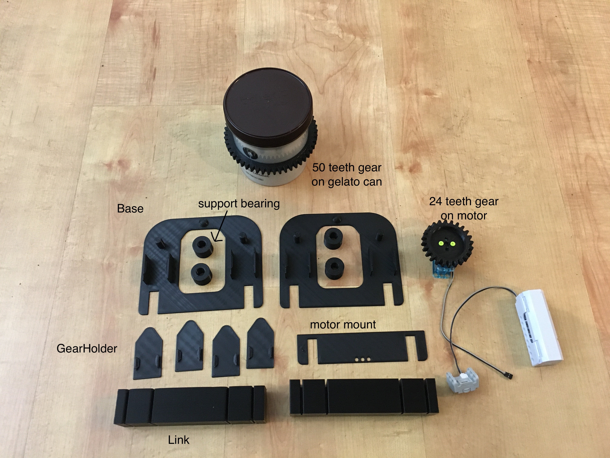

The first try was discard on the sketch stage.  

The second try was fully designed and printed. Total 15 parts need to be printed. The supporting structure uses 12 printed parts and works. Improvement definitly needed..
- base          x2
- gearHolder    x4
- link          x2
- supportbearingx4 
- 24 teeth gear x1
- 50 teeth gear x1
- motormount    x1

</a>
</a>
